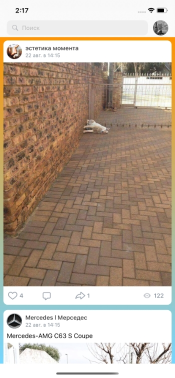

# Новостная лента VK

Приложение является реализацией модуля новостной ленты VK.

 

## Особенности приложения
 - архитектура Clean Swift;
 - программная реализация интерфейса через код и адаптация UI под различные размеры экрана;
 - просмотр двух и более фотографий с использованием UICollectionView;
 - работа с VK iOS SDK.
## Функционал приложения
### Просмотр новостной ленты
Что содержит в себе пост новостной ленты:
 - имя источника;
 - время публикации;
 - фотография источника;
 - текст поста;
 - фотографии поста, если они есть;
 - активная ссылка, если она есть;
 - количество лайков, комментариев, репостов, просмоторов.
 
 Посты загружаются с использованием VK iOS SDK, посредством сетевых запросов.
 
Новостная лента реализуется с использованием UITableView и кастомных ячеек. Для отображения двух и более фотографий используется UICollectionView.
Особенности ячейки UICollectionView:
 - изменение размера в зависимости от значения соотношения фотографии;
 - округление и тень.

Особенности работы новостной ленты:
- при наличии длинного текста в посте появляется кнопка "Показать полностью";
- смахивая новостную ленту вниз в самом ее начале, происходит обновление новостной ленты;
- при прокрутке новостной ленты в ее конец, то отправляется сетевой запрос на получение старых постов.

